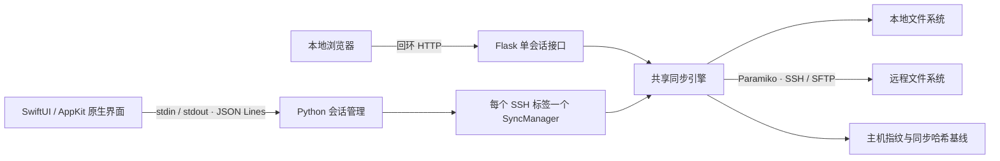

# Folder Link

**通过 SSH，让 Mac 与远程服务器上的文件夹保持同步。**

Folder Link 是一款轻量的文件同步工具，提供原生 macOS App 和本地网页界面。原生 App 使用 SwiftUI / AppKit 毛玻璃界面，支持多个 SSH 标签、远程目录浏览、双向同步和单向拉取。同步通过 SFTP 完成，远程服务器无需安装额外代理程序。

> 当前版本：1.1.0。原生构建脚本面向 Apple Silicon（arm64）；发布源码，使用者可按下文自行编译。

## 功能

| 功能 | macOS App | 本地网页版 |
| --- | --- | --- |
| SSH 账号、密码连接与主机指纹校验 | 支持 | 支持 |
| 本地与远程新增、修改文件双向同步 | 支持 | 支持 |
| 手动同步一次、自动同步、停止任务 | 支持 | 支持 |
| 同名文件冲突提示与版本选择 | 支持 | 支持 |
| 上传、下载统计与运行日志 | 支持 | 支持 |
| 多个 SSH 标签独立运行 | 支持 | 单会话 |
| 浏览并选择远程文件夹 | 支持 | 手动输入路径 |
| 单独拉取远程目录到本地 | 支持 | 界面未提供 |
| 原生毛玻璃窗口与系统文件夹选择器 | 支持 | macOS 可调用目录选择器 |

原生 App 的各个标签独立保存连接配置、同步状态和日志。切换标签不中断任务；关闭一个标签只停止该标签的任务。关闭窗口后 App 继续运行，退出 App 会停止全部任务。

密码仅用于当前会话，不写入配置文件或系统钥匙串。重启后恢复非密码连接配置，需要重新输入密码。

## 同步规则

Folder Link 是文件同步工具，不是远程磁盘挂载，也不提供 SSH 终端。

### 双向同步

- 只有一端存在的文件：复制到另一端，并保留相对目录结构。
- 只有一端修改：根据上次成功同步的内容哈希判断方向，更新另一端。
- 首次同步时同名文件内容不同，或两端均有不同修改：保留两端文件并提示冲突，由使用者选择“保留本地”或“保留远程”。
- 未处理的内容冲突不会覆盖文件，其他可同步的文件继续处理。
- 自动模式在每轮完成后等待 **3 秒**，再开始下一轮；扫描与传输耗时另计。

### 拉取远程

“拉取远程”只下载远程目录中的文件，不上传、不删除，也不在服务器上创建目录。远程目录须已存在。本地同名文件有无法排除的修改时仍提示冲突；“保留本地”会跳过该文件，“保留远程”会用远程版本更新本地。

### 删除、忽略与边界

- **不联动删除**：双向同步时，单端删除的文件会从另一端恢复；重命名可能留下新旧两个文件。需要永久删除时，先停止同步，再删除两端对应文件。
- 默认忽略 `.git`、`.venv`、`node_modules`、`__pycache__`、`.DS_Store`、`.runtime`、`.pytest_cache` 和工具临时文件；不解析 `.gitignore`。
- 其他隐藏文件会参与同步，包括 `.env`。请选择明确需要同步的目录。
- 跳过目录内的符号链接及两端对应路径，不复制 ACL、所有者或扩展属性；普通文件复制权限位与修改时间。
- 每轮读取文件内容计算 SHA-256，适合小型工作目录；大文件和大量文件会增加带宽与扫描时间。
- 传输使用临时文件，并在替换前重新核对内容。远程覆盖依赖 SFTP `posix-rename` 扩展，不支持时保留目标文件并报错。
- 网络错误后任务停止，修复连接后需重新开始；未实现断点续传、自动重连或开机自启。
- 原生 App 阻止多个运行任务使用重叠的本地目录，或相同主机名、端口和账号下重叠的远程路径。主机别名及不同路径指向同一物理目录的情况无法全面识别。

## 架构



### 原生 App

`macos/FolderLink.swift` 实现窗口、表单、标签页、目录浏览和冲突处理。App 启动内置的 Python 子进程，通过私有标准输入、输出管道交换 JSON 消息，不启动 HTTP 服务。

`macos/backend.py` 按会话 ID 分配同步管理器，处理连接测试、远程目录读取、任务启动、停止和标签关闭。每个运行任务使用独立线程与 SFTP 连接；App 退出时请求全部任务停止。

### 同步引擎

`sync_engine.py` 负责路径校验、SSH 主机密钥校验、文件扫描、SHA-256 内容比较、冲突识别和临时文件传输。同步基线以“主机、端口、账号、本地目录、远程目录”为单位保存，重启后可继续识别文件改动。

### 本地网页版

`app.py` 提供 Flask 页面及接口，`templates/` 和 `static/` 提供 HTML、CSS、JavaScript。服务仅监听 `127.0.0.1`，写入接口校验随机 token 与 Origin。网页版与原生 App 复用同步引擎，但配置和会话管理互相独立。

### 源码结构

```text
folder-link/
├── macos/
│   ├── FolderLink.swift      # 原生界面、多标签、进程通信
│   ├── backend.py           # 多会话 JSON Lines 接口
│   ├── Icon.swift           # 图标生成脚本
│   ├── build.sh             # macOS App 构建与本机签名
│   └── README.md            # 原生 App 操作说明
├── sync_engine.py           # SSH / SFTP 同步引擎
├── app.py                   # 本地网页入口
├── templates/               # 网页模板
├── static/                  # 网页资源
├── tests/                   # 同步、接口与多会话测试源码
├── requirements.txt         # Python 运行依赖
├── requirements-dev.txt     # 测试与打包依赖
├── 启动工具.command          # macOS 网页版启动入口
└── LICENSE                  # MIT 许可证
```

## 从源码编译 macOS App

### 环境要求

- Apple Silicon Mac。当前构建脚本固定输出 arm64，不生成 Intel 或 Universal App。
- 安装并选中包含 SwiftUI / AppKit SDK 的 Xcode 工具链，可通过 `xcode-select -p` 查看。
- Python 3.10 或更新版本，以及 Git。
- 初次安装 Python 依赖需要联网。

原生编译目标与 App 清单声明 macOS 14.0+。实际最低可运行系统还取决于构建时的 Python 和二进制依赖，旧版 macOS 兼容性需要使用者验证。

### 编译

```bash
git clone https://github.com/SodrSnne/folder-link.git
cd folder-link

python3 -m venv .venv
.venv/bin/python -m pip install -r requirements-dev.txt
./macos/build.sh
```

构建脚本依次打包 Python / Paramiko 引擎、编译 Swift 界面、生成图标与 `Info.plist`，最后执行本机 ad-hoc 签名。产物位于：

```text
dist/Folder Link.app
```

App 已内置 Python 解释器和依赖，运行时无需保留虚拟环境或源码目录。

### 安装与启动

首次安装可将 `dist/Folder Link.app` 拖入“应用程序”，或执行：

```bash
mkdir -p "$HOME/Applications"
ditto "dist/Folder Link.app" "$HOME/Applications/Folder Link.app"
open "$HOME/Applications/Folder Link.app"
```

更新安装前先退出旧版 App。构建脚本只生成产物，不会自动替换已安装的 App 或自动启动同步。

当前构建为本机签名，未进行 Apple Developer ID 签名与公证。向其他电脑正式分发时，应另行完成签名、公证和目标系统兼容性验证；本机签名不保证下载后的 Gatekeeper 验证通过。

## 使用 macOS App

1. 点击顶部 `+` 或按 `⌘T` 新建 SSH 标签。
2. 填写服务器 IP / 主机名、SSH 端口、账号与密码。
3. 点击“测试连接”；首次连接核对服务器指纹后继续。
4. 选择已存在的本地文件夹。远程路径可手动填写，也可点击“浏览远程”，进入目标目录后选择“选择此文件夹”。浏览器可列出文件名与大小，不读取文件正文。
5. 点击“拉取远程”“同步一次”或“开始自动同步”。
6. 发生冲突时，在当前标签的“同步动态”中选择需要保留的版本。

服务器需允许 SSH 密码登录并启用 SFTP。当前未提供私钥、SSH Agent、跳板机或 `~/.ssh/config` 配置界面。双向同步可创建不存在的远程子目录，但本地目录须先创建；远程根目录 `/` 不能作为同步目标。

快捷键：`⌘T` 新建标签、`⌘Return` 开始当前标签自动同步、`⌘0` 显示主窗口、`⌘Q` 退出 App。

## 运行本地网页版

网页版无需编译 Swift，适合只需要单连接双向同步的使用者。

```bash
python3 -m venv .venv
.venv/bin/python -m pip install -r requirements.txt
.venv/bin/python app.py
```

默认打开 `http://127.0.0.1:8765`。macOS 也可双击仓库中的 `启动工具.command`；该脚本首次启动时自动创建虚拟环境并安装运行依赖。

自定义端口或不自动打开浏览器：

```bash
.venv/bin/python app.py --port 8766 --no-browser
```

Windows 使用 `.venv\Scripts\python.exe` 替换命令中的 `.venv/bin/python`，手动填写本地绝对路径。网页版主要开发环境为 macOS，其他平台需自行验证。它是本机工具，不建议将接口直接暴露到公网。

关闭网页不会停止后台任务；可先点击“停止同步”，再在启动终端按 `Ctrl+C` 退出服务。

## 配置与本地数据

| 数据 | macOS App | 网页版 |
| --- | --- | --- |
| 非密码连接配置 | UserDefaults，域 `local.folderlink.mac` | 浏览器 localStorage |
| 主机指纹与内容哈希基线 | `~/Library/Application Support/Folder Link/` | 项目目录 `.runtime/` |
| 密码 | 当前标签与活动请求 / 任务内存 | 当前页面与活动请求 / 任务内存 |

SSH 客户端也会读取 `~/.ssh/known_hosts`。主机密钥变化时拒绝连接。删除基线后，已有不同内容会按首次同步重新判断冲突。原生 App 和网页版不要同时同步同一组目录。

## 开发与验证

仓库提供 pytest 测试源码，覆盖双向同步、冲突、只下载、远程目录读取、多会话隔离、主机校验、传输中断和本地 HTTP 访问控制。需要自行验证时执行：

```bash
.venv/bin/python -m pip install -r requirements-dev.txt
.venv/bin/python -m pytest -q
```

测试使用临时文件夹和本机临时 SSH/SFTP 服务，不需要真实服务器账号。构建与测试目录、运行配置、开发辅助文档不属于发布源码。

欢迎提交 Issue 或 Pull Request。报告问题时请提供操作系统、Python / Xcode 版本、复现步骤和脱敏日志，不要附带密码或私钥。

## 许可证

项目采用 [MIT License](LICENSE)。第三方依赖遵循各自的许可证。
